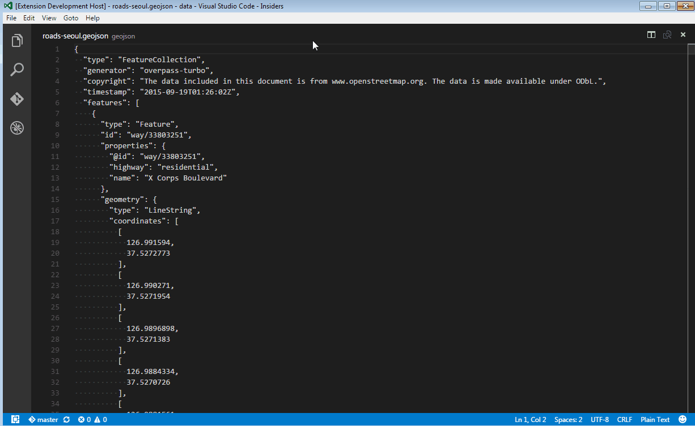

# VSCode Map Preview

This extension provides the ability to preview spatial data files and snippets on a map

# Supported Formats

Support for various formats is available through the format drivers provided by the [OpenLayers](http://openlayers.org/) library

 * [GPX](http://openlayers.org/en/latest/apidoc/ol.format.GPX.html)
 * [GeoJSON](http://openlayers.org/en/latest/apidoc/ol.format.GeoJSON.html)
 * [IGC](http://openlayers.org/en/latest/apidoc/ol.format.IGC.html)
 * [KML](http://openlayers.org/en/latest/apidoc/ol.format.KML.html)
 * [TopoJSON](http://openlayers.org/en/latest/apidoc/ol.format.TopoJSON.html)
 * [WFS](http://openlayers.org/en/latest/apidoc/ol.format.WFS.html)
 * [GML](http://openlayers.org/en/latest/apidoc/ol.format.GML.html)
 * [GML2](http://openlayers.org/en/latest/apidoc/ol.format.GML2.html)
 * [GML3](http://openlayers.org/en/latest/apidoc/ol.format.GML3.html)
 * [WKT](http://openlayers.org/en/latest/apidoc/ol.format.WKT.html)

# How to use this extension

Open any plain text file (or active open document) and run the `Map Preview` command from the command palette. If the 
text content checks out as any of the above supported formats, it will be parsed into vector feature data
to be shown on an interactive map in the HTML preview pane.

See attached gif for an example:

 

# Caveats/Limitations

 * The data you are previewing must be convertible to [Web Mercator](http://wiki.openstreetmap.org/wiki/EPSG:3857), in order to properly overlay against any of the provided base map layers.
 * Will probably choke on really large data files (this extension is really meant for quick-and-dirty previews of small files and snippets)